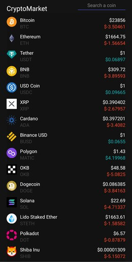

# Lista de precios de criptomonedas

Este proyecto consiste en una aplicación móvil creada con React Native y Expo que muestra una lista de los valores actuales de las criptomonedas utilizando la API de coingecko. La interfaz de usuario es elegante y se pueden filtrar las criptomonedas por nombre o abreviación. 

## Tecnologías principales
 React Native  
 JavaScript  
 Expo  
 API Coingecko  
StyleSheet

## Capturas de pantalla
A continuación, se muestra una captura de pantalla de la aplicación en un dispositivo móvil:

## Créditos
Este proyecto fue creado a partir de un video tutorial en el canal de "Fazt Code" en YouTube. Puedes ver el tutorial en este [enlace](https://www.youtube.com/watch?v=k9ptn9zNHng).

## Link
Para probar la aplicación, puedes escanear el siguiente código QR con la aplicación de Expo Go:

También puedes descargar la aplicación de Expo Go desde las siguientes tiendas de aplicaciones:
- [Expo Go en Google Play](https://play.google.com/store/apps/details?id=host.exp.exponent&referrer=www)
- [Expo Go en App Store](https://apps.apple.com/app/apple-store/id982107779)

¡Disfruta de la lista de precios de criptomonedas en tu dispositivo móvil!
